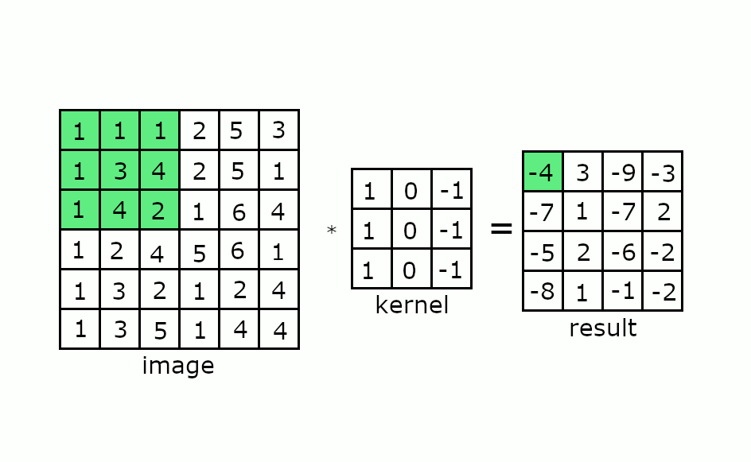
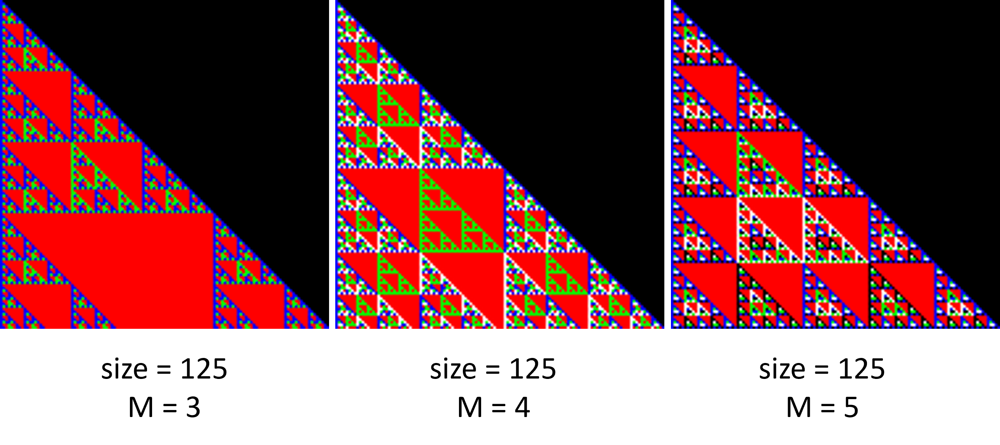

# PPM Image Processing

## Description

Image processing utilities for handling **PPM (Portable Pixmap)** format images, as defined by the [Netpbm](https://en.wikipedia.org/wiki/Netpbm) format. It includes functions for image *concatenation* (*vertically and horizontally*), *rotation*, and *generating visual patterns* from **Pascal's triangle with color modulation**. Designed to be **purely functional**, avoids *side effects* and *mutable state*.

### Getting Started

- Ensure that `Scala` and `sbt` are installed on your machine.
- The main functions are encapsulated in `Solution.scala`, with utily types and functions defined in: `util/Util.scala` and `util/Pixel.scala`.

### PPM File Structure

- PPM files start with the header `P3`, indicating the PPM format, followed by the image's `width` and `height`, and the **maximum color value**, which is *always* `255`. 
- Each pixel's RGB values are listed sequentially, **one pixel per line**, with *no additional spaces after the blue value*.

### Image Structure

- `Pixel` holds **integer RGB values**.
- **Images** are a list of lists of Pixel objects:
  - (*`Image = List[List[Pixel]]`*)
- **Grayscale** image  witha gray filter, contains double precision values:
  - (*`GrayscaleImage = List[List[Double]]`*)

## Combine and Rotate

- **Vertical Concatenation:** Combines two images of the same width into one, with the **first** image **on the top** and the **second on the bottom**.
- **Horizontal Concatenation:** Joins two images of the same height side by side, with the **first** image **on the left** and the **second on the right**.
- **Image Rotation:** Rotates an image by multiples of **90 degrees counterclockwise**.

## Sobel Edge Detection

The `Sobel Edge Detection` applies a series of steps to detect edges within an image. It onverts the image to **grayscale**, applying **Gaussian blur** to smooth the image, using the **Sobel operator** to detect edge gradients, combining these gradients to highlight edges, and applying a threshold to distinguish edges clearly.

**Example:** (how the convolution is performed on matrixes)

    

**Grayscale Conversion:** simplifies an image to shades of gray, reducing complexity and focusing on intensity, which is crucial for the effectiveness of blur and edge detection processes.

**Gaussian Kernel:** applied to the image using a convolution kernel, which is a matrix of weights. The **Blur Gaussian kernel** is determined based on the *Gaussian function*, it assigns higher weights to pixels closer to the center of the kernel and lower weights to those further away.

$$ gaussianBlurKernel =
\begin{bmatrix}
    \frac{1}{273} & \frac{4}{273} & \frac{7}{273} & \frac{4}{273} & \frac{1}{273} \\
    \frac{4}{273} & \frac{16}{273} & \frac{26}{273} & \frac{16}{273} & \frac{4}{273} \\
    \frac{7}{273} & \frac{26}{273} & \frac{41}{273} & \frac{26}{273} & \frac{7}{273} \\
    \frac{4}{273} & \frac{16}{273} & \frac{26}{273} & \frac{16}{273} & \frac{4}{273} \\
    \frac{1}{273} & \frac{4}{273} & \frac{7}{273} & \frac{4}{273} & \frac{1}{273}
\end{bmatrix}
$$

**Convolution Process:** each pixel is recalculated using a weighted average of itself and surrounding pixels based on the Gaussian kernel. The convolution with these **intensity edge kernels** adjusts the brightness of each pixel based on its neighbors, the result is softened edges.

$$ G_x =
\begin{bmatrix}
-1 & 0 & 1 \\
-2 & 0 & 2 \\
-1 & 0 & 1 \\
\end{bmatrix}
\quad G_y =
\begin{bmatrix}
1 & 2 & 1 \\
0 & 0 & 0 \\
-1 & -2 & -1 \\
\end{bmatrix}
$$

**Edge Detection:** reducing noise and softening the image, Gaussian blurring makes it easier to identify significant transitions in intensity, which correspond to edges in the image which relies on these transitions to outline the important structures within the image.

## Pascal Triangle

The `Pascal's Triangle` displays a **fractal-like aspect** when colored with a **modulo operation**, revealing self-repeating patterns that emerge from simple *reccursion rules*.

    

The simplest way to describe a line in Pascal's Triangle is:

- The first and last element is always 1, described by $l_0 = l_n = 1$.
- For the rest of the elements in the triangle, the recursion $l_i = l_{i-1}^p + l_i^p$ is used, where $l$ is the current line, and $l^p$ is the previous line.

Colors are defined by `Pixel` object value, with the `pickColor` function determining the color mapping. Any values above the main diagonal default to black, remaining unaltered by `pickColor`.

**Note:** that a value on line $n$ and column $k$ is $C_n^k$ its value is the sum above it, becoming $C_n^k = C_{n-1}^{k-1} + C_{n-1}^k$. Each line in Pascal's Triangle is denoted by $C_n^0, C_n^1, \ldots, C_n^n$ for line number $n$.

$$
C_{mod}^{k} = C_{n}^{k} mod M
= (C_{n-1}^{k-1} + C_{n-1}^{k}) mod M
= ((C_{n-1}^{k-1} mod M) + (C_{n-1}^{k} mod M)) mod M
$$

Pascal's Triangle with modulo operations generates visual patterns, where the modulus value $M$ dictates the number of color variations. This approach creates a repeating color pattern across the triangle.
